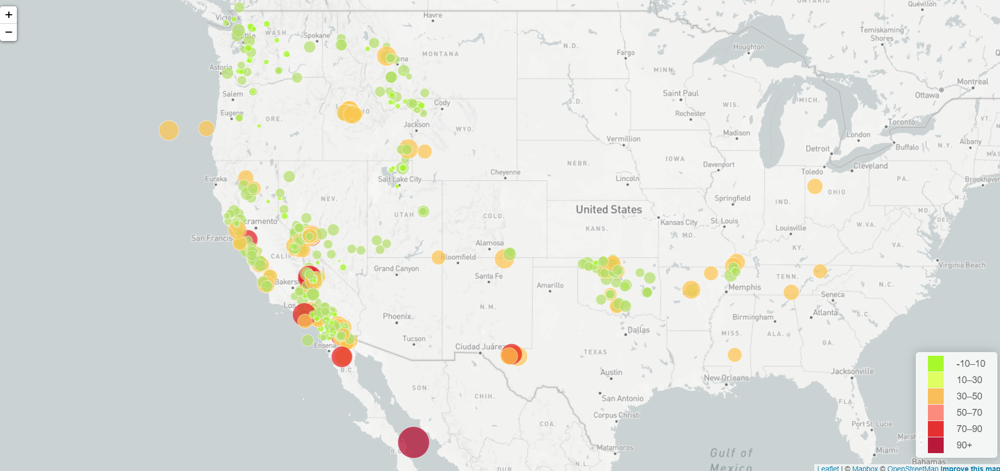
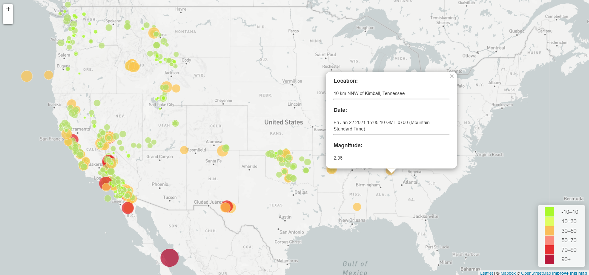
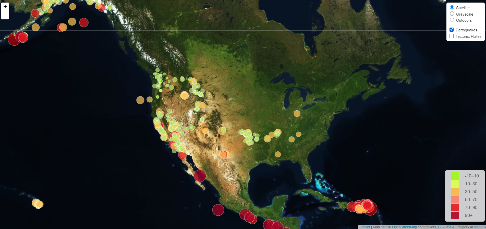
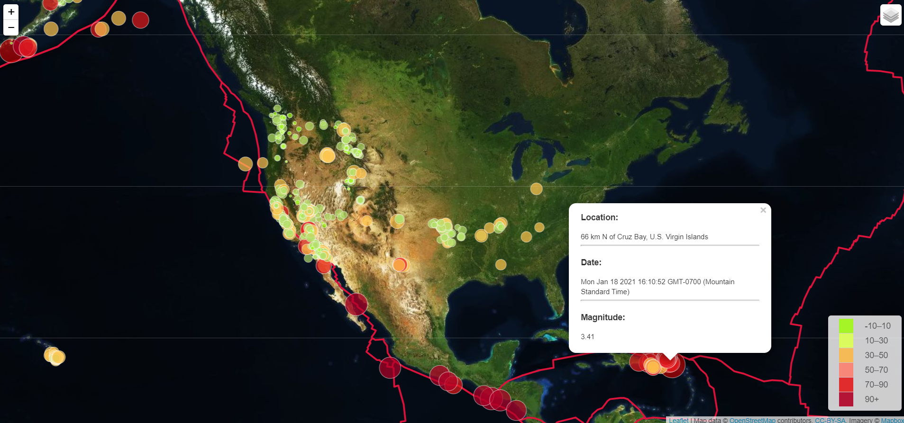
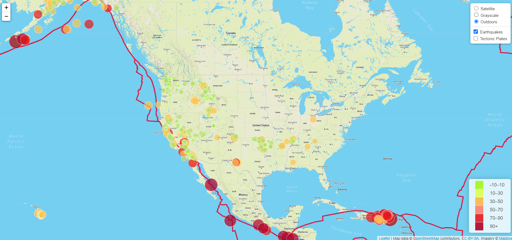

# Visualizing Data with Leaflet 

# 

United States Geological Survey, or USGS, is responsible for providing scientific data about natural hazards, the health of our ecosystems and environment; and the impacts of climate and land-use change. Their scientists develop new methods and tools to supply timely, relevant, and useful information about the Earth and its processes.

Building a new set of tools that will allow the USGS to visualize their earthquake data. The USGS collects a massive amount of data from all over the world each day, but they lack a meaningful way of displaying it. Their hope is that being able to visualize their data will allow them to better educate the public and other government organizations (and hopefully secure more funding..) on issues facing our planet.

1. **Retrieved Data Set**

   

2. **Imported & Visualize the Data**

   - Created a map using Leaflet that plots all of the earthquakes from data set based on their longitude and latitude.

   * Data markers reflect the magnitude of the earthquake by their size and and depth of the earth quake by color. Earthquakes with higher magnitudes appears larger and earthquakes with greater depth appears darker in color.

   * Included popups that provide additional information about the earthquake when a marker is clicked.

   * Created a legend that will provide context for map data.

### Level 1:  Created a Basic Visualization

- - -

### Level 2: Created an Advanced Visualization

Plotted a second data set on the map to illustrate the relationship between tectonic plates and seismic activity. Pulled in a second data set and visualized it along side original set of data. Data on tectonic plates were found at <https://github.com/fraxen/tectonicplates>.

* Plotted a second data set on our map.

* Added a number of base maps to choose from as well as separate out our two different data sets into overlays that can be turned on and off independently.

* Added layer controls to our map.

- - -

### Copyright

Fereshteh Aghaei © 2021. All Rights Reserved.
